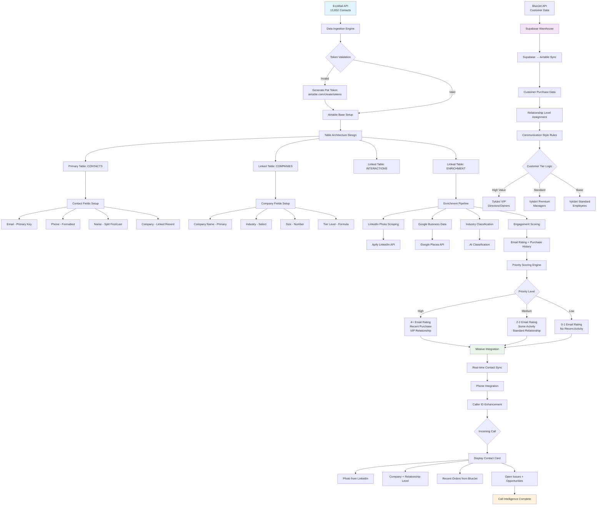
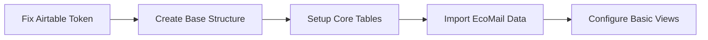
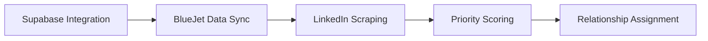
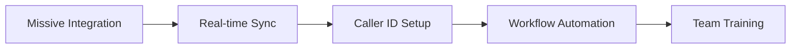
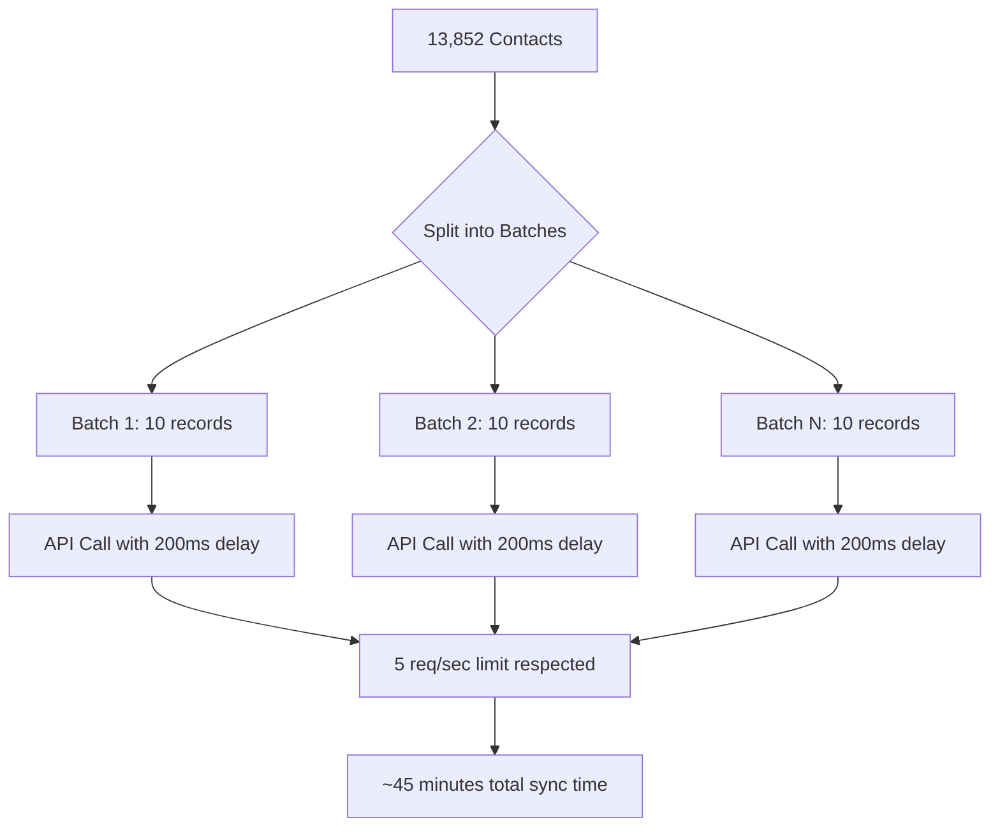
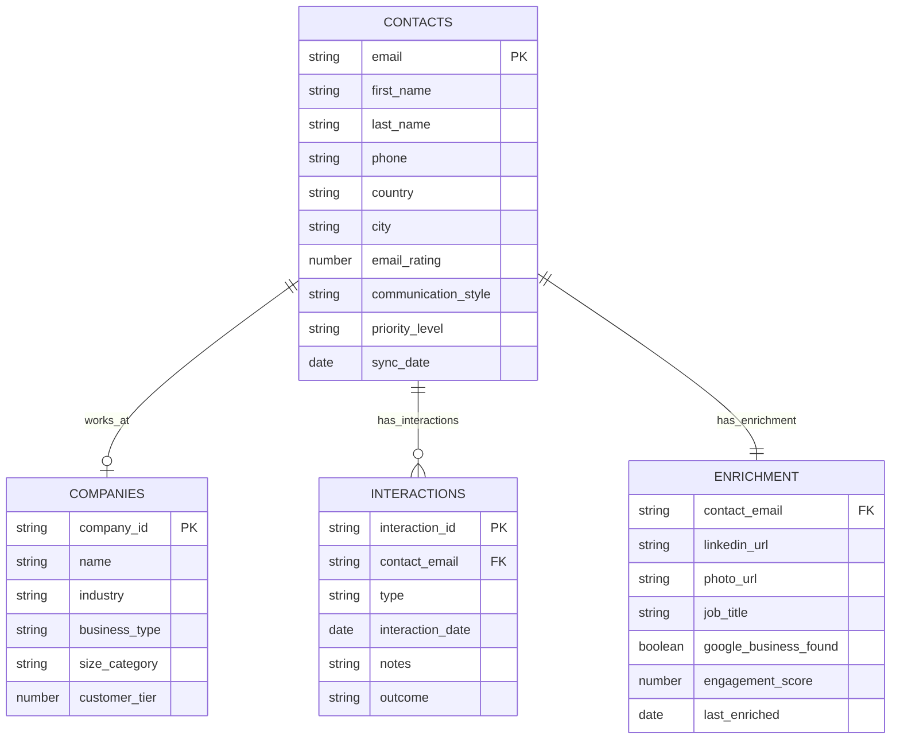
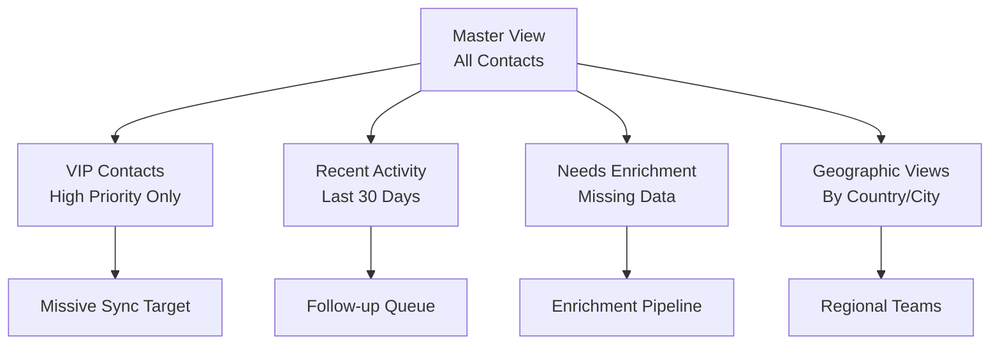
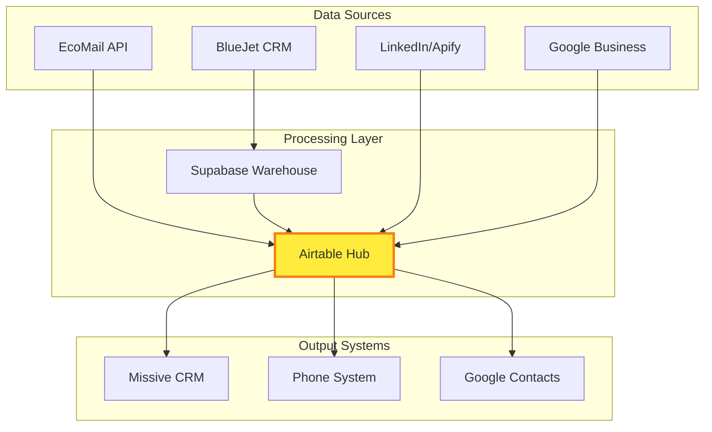

# PREMIUM GASTRO AIRTABLE OPTIMIZATION FLOWCHART
## Contact Management System - Maximum Potential Utilization

## IMPLEMENTATION PHASES

### PHASE 1: FOUNDATION (Week 1-2)

### PHASE 2: ENRICHMENT (Week 3-4) 

### PHASE 3: AUTOMATION (Month 2)

## API OPTIMIZATION STRATEGY

### Batch Processing Flow

## DATA ARCHITECTURE

### Table Relationships

## PERFORMANCE OPTIMIZATION

### View Configuration Strategy

## INTEGRATION FLOW

### Complete System Architecture

## SUCCESS METRICS

### KPIs to Track
- **Data Quality**: 95%+ complete contact profiles
- **Sync Performance**: <2 minutes for incremental updates  
- **User Adoption**: 100% team usage within 30 days
- **Call Intelligence**: <200ms contact lookup time
- **ROI**: 4,400% email marketing improvement (from research)

## TROUBLESHOOTING GUIDE

### Common Issues & Solutions
1. **401 Authentication**: Regenerate PAT token with proper scopes
2. **Rate Limiting**: Implement exponential backoff + batch processing
3. **Data Conflicts**: Use email as unique identifier across systems
4. **Performance**: Limit formula fields, optimize views
5. **Sync Failures**: Implement error logging + retry mechanisms

---

**STATUS**: Ready for implementation with valid Airtable PAT token starting with "pat..."